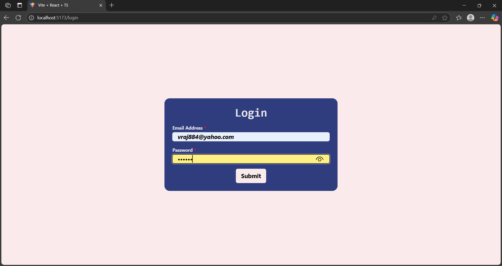
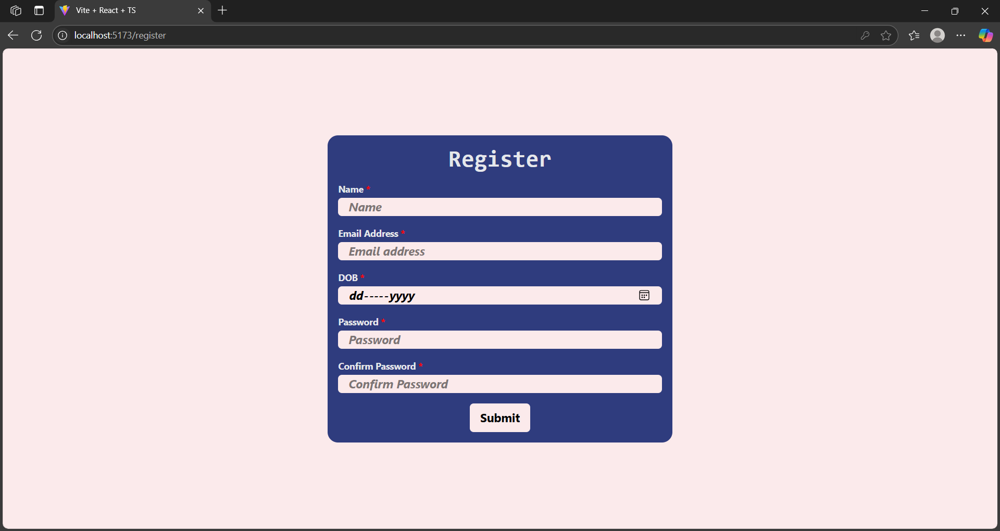
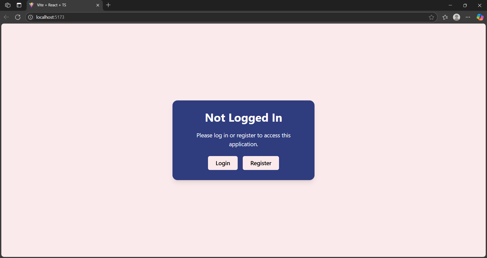
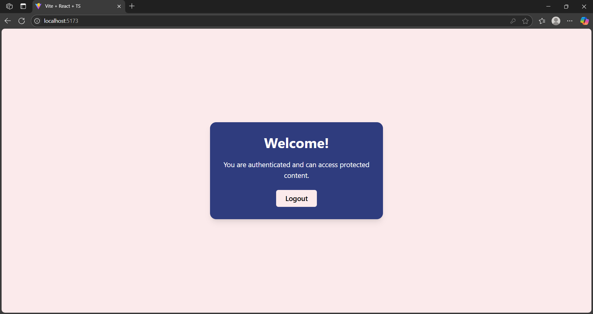

# 🔐 Full-Stack Auth Template (React + Express + MongoDB)

A clean and secure full-stack authentication project using:

- ⚛️ React + TypeScript + Zustand + Tailwind (Frontend)
- 🚀 Express + MongoDB + JWT + Cookies (Backend)

> 🎓 **Perfect for college students or beginner developers!**  
> This ready-made authentication template provides a fast and reliable starting point for building full-stack applications with login/register functionality and protected routes.

This project is cookie-based and supports refresh token authentication for persistent login.


---

## 📁 Folder Structure

```
root/
├── app/         # React Frontend
│   ├── public/
│   ├── src/
│   └── ...
│
├── backend/     # Express Backend
│   ├── controllers/
│   ├── middleware/
│   ├── models/
│   ├── routes/
│   └── ...
│
└── README.md    # You are here
```

---

## 🧠 Tech Stack

### Frontend (`/app`)
- React 18
- TypeScript
- Zustand (state management)
- Tailwind CSS
- React Router DOM

### Backend (`/backend`)
- Express.js
- MongoDB + Mongoose
- JWT (access & refresh tokens)
- bcrypt (password hashing)
- cookie-parser + CORS
- dotenv

---

## 🚀 Setup Instructions

### 1️⃣ Clone the Repo

```bash
git clone https://github.com/Vraj884/auth-template-fullstack.git
cd auth-template-fullstack
```

---

### 2️⃣ Setup Backend

```bash
cd backend
npm install
```

#### Create `.env` file:

```
PORT=7000
URI=mongodb://localhost:27017/authDB
JWTKEY=your-access-token-secret
REFRESH_KEY=your-refresh-token-secret
NODE_ENV=development
```

#### Start MongoDB:

```bash
mongod
```

#### Start Backend Server:

```bash
npm run dev
```

Your backend will run at: `http://localhost:7000`

---

### 3️⃣ Setup Frontend

```bash
cd ../app
npm install
npm run dev
```

Frontend runs on: `http://localhost:5173`

Make sure backend is running first so auth endpoints work.

---

## 🔐 Auth Flow Overview

1. **Register / Login**
   - Frontend sends credentials → Backend verifies and returns `accessToken` (15m) + `refreshToken` (7d) as HTTP-only cookies

2. **On App Load**
   - Frontend checks `/check` route to validate refresh token
   - If valid, `/refresh` issues a new access token

3. **Protected Routes**
   - `isLoggedIn` flag from Zustand determines UI
   - Backend uses `verifyAccessToken` middleware from `middleware/authcheck.js` to secure APIs

4. **Logout**
   - Both tokens are cleared using `.clearCookie()` on `/logout`

> 💡 **Feel free to extend the registration form with additional fields** (e.g., phone number, role, profile picture, etc.) and update the backend controller and `userSchema` accordingly.

---

## 📸 Screenshots

### Login Page


### Register Page


### Home Page - without login


### Home Page - with login


> 🎨 **Feel free to customize or redesign the frontend UI** — this is a base template meant to speed up development, not restrict design creativity.

---

## ⚠️ Security Notices

### Frontend
- ✅ Tokens are stored in `httpOnly` cookies
- ⚠️ **Add CSRF protection** or enforce `SameSite=Strict`
- ⚠️ Implement route guards for protected routes

### Backend
- ✅ Passwords hashed with bcrypt
- ⚠️ **No rate-limiting** — add `express-rate-limit` for login
- ⚠️ **No refresh token DB validation** — consider blacklisting
- ⚠️ **No input validation** — use `express-validator`
- ⚠️ CSRF protection and HTTPS are mandatory in production

---

## 🌍 Deployment Prep

| Task | Status |
|------|--------|
| Set cookies as `secure: true` in production | ✅ Done via `isProd` flag |
| Use HTTPS & custom domains (Netlify/Vercel + Render) | ✅ Recommended |
| Add environment-specific `.env` files | ✅ |
| Add `.gitignore` and ignore `node_modules`, `.env` | ✅ |

---

## 🧾 License

[MIT](LICENSE)

---

## 📬 Contact

Made with ❤️ by [Vraj Patel](https://github.com/your-username)
